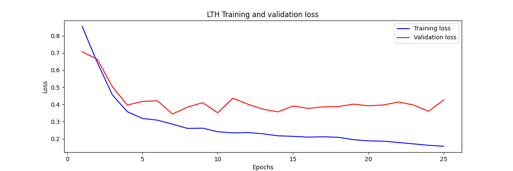
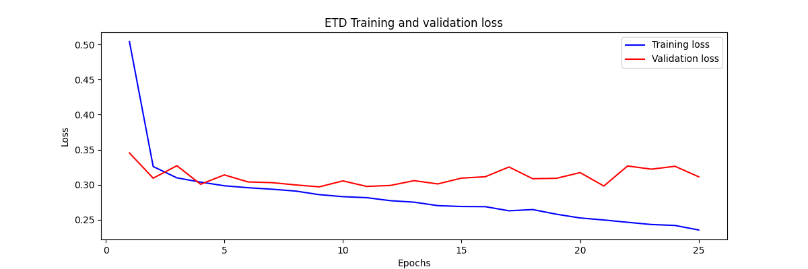
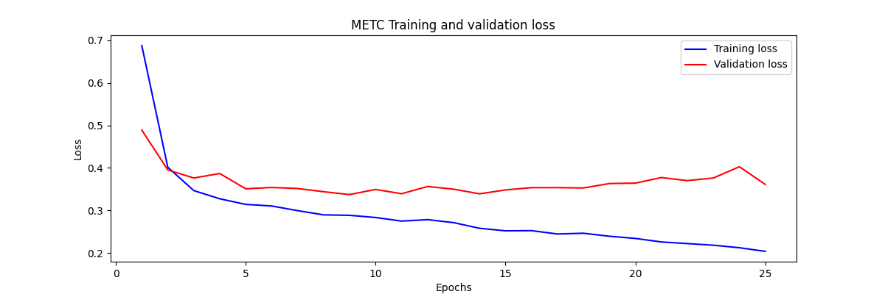
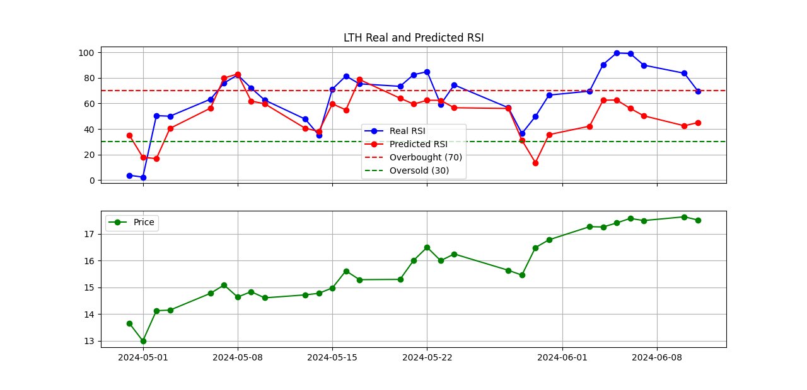
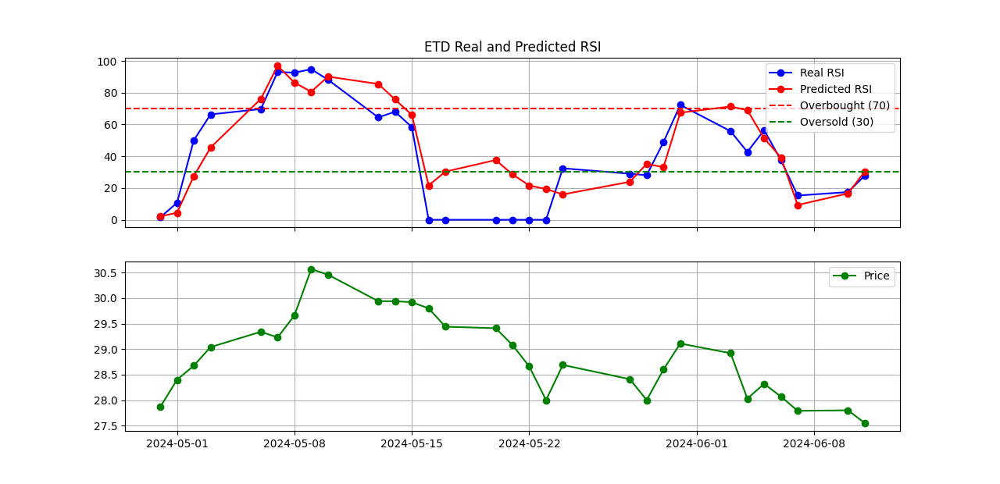
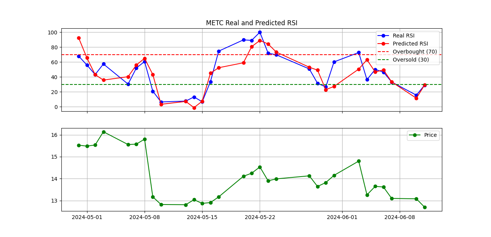

# RSI-of-stocks-prediction
This project predicts the Relative Strength Index (RSI) of stocks using 1D Convolutional Neural Networks (CNN) and Long Short-Term Memory (LSTM) neural networks. Each company (LTH, ETD, and METC) is trained individually.
### Features
  The model utilizes various technical indicators of stock prices as features. These features are filtered based on their correlation with the RSI indicator for each company.
### Target label
  The target label is the Relative Strength Index (RSI), a momentum indicator that assesses whether a stock is overbought or oversold. An RSI above 70 indicates overbought conditions, suggesting a potential correction, while an RSI below 30 indicates oversold conditions, suggesting a potential rebound. The continuous nature of RSI (ranging from 0 to 100) allows for a nuanced understanding of market conditions, capturing varying degrees of overbought and oversold states.

## Installation

To set up the project on your local machine, follow these steps:

1. **Clone the repository**:

    ```bash
    git clone https://github.com/Shanty-01/stock-price-prediction.git
    cd stock-price-prediction
    ```

2. **Create and activate a virtual environment**:

    ```bash
    python -m venv venv
    source venv/bin/activate  # On Windows use `venv\Scripts\activate`
    ```

3. **Install the required packages**:

    ```bash
    pip install -r requirements.txt
    ```

## Usage
```
  python stock_price_prediction.py
```
    
## Model Architecture
The model architecture combines 1D Convolutional Neural Networks (CNN) and Long Short-Term Memory (BLSTM) layers to capture spatial and temporal dependencies in stock price data.

- CNN Layer
Extracts local features from the input time series data.
- LSTM Layer
Captures long-term dependencies and relationships in the data.
- Dense Layers
Final dense layers for output prediction.

## Results 
### Training and Validation Loss

minimum validation loss (MSE) : 0.343

minimum validation loss (MSE) : 0.296

minimum validation loss (MSE) : 0.337
### Predicted vs Real RSI



